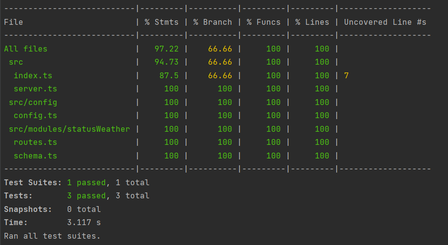

## Fastify DMI-TEST Open Weather

Using the Fastify framework, implement an endpoint that allows the API client to respond with a boolean if the temperature in the city of Rio Cuarto is greater or less than 15 degrees using the API

## For the exercise, it is evaluated in order of importance:

1. Correct functioning of the API
2. Project structure and code style
3. Documentation
4. Unit tests
5. Extensibility. For example, if you wanted to know the same information for another city
6. Create a Fastify plugin to manage cache

## Project structure

I followed the pattern ands generate a project with the same
structure by using [fastify-cli](https://github.com/fastify/fastify-cli).

## How to run this project

### Locally

1. Use Node.js v16.

    ```sh
    curl -o- https://raw.githubusercontent.com/nvm-sh/nvm/v0.37.2/install.sh | bash
    nvm install 16
    node -v # should be v14.minor.patch
    ```

2. Install the project dependencies:

    ```sh
    yarn install
    ```

3. Run the proyect

    ```sh
    yarn dev
    ```

4. Run test:

    ```sh
     yarn test
    ```

   
   
5. Get to swagger documentation:

    ```sh
    http://localhost:3000/docs/index.html
    ```

### Contribute

1. [Fastify](https://www.fastify.io/)
2. [Typescript](https://www.typescriptlang.org/)
3. [Jest](https://jestjs.io/)
4. [WeatherData](https://openweathermap.org/current)


